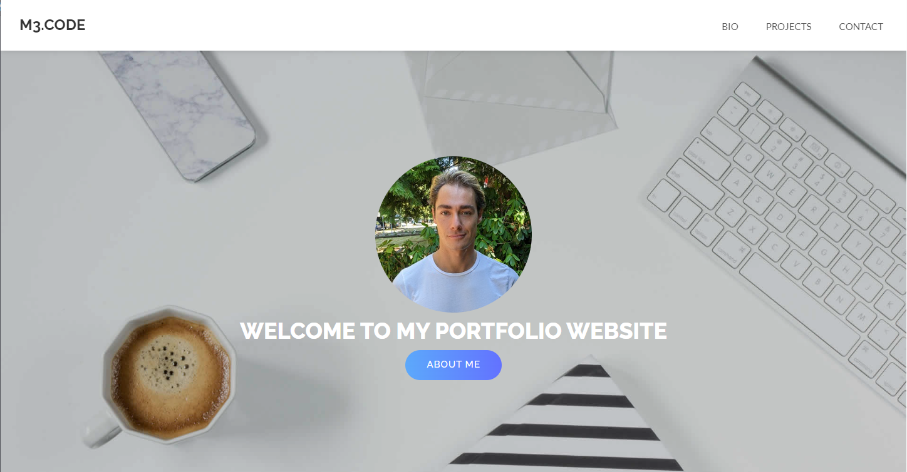

# My Portfolio Landing Page

## Description

This is a portfolio landing page showcasing my web development projects. It is built using Vite, React with TypeScript template, and styled with Bootstrap.

## Features

- Display of personal information and introduction.
- Showcase of two featured projects from my GitHub repositories.
- Links to my GitHub profile and other social media platforms.
- Responsive design for optimal viewing on various devices.

## Technologies Used

- Vite: A fast and efficient development server and build tool for modern web projects.
- React with TypeScript: A powerful combination for building scalable and maintainable web applications.
- Bootstrap: A popular CSS framework for responsive and attractive styling.
- GitHub API: Used to fetch and display my GitHub projects on the landing page.
- This page will be hosted thanks to the GitHub Pages site.

If you have any questions or would like to get in touch, you'll know how to reach me ;-) (.c.f info on my landing page or on my GitHub profile).
